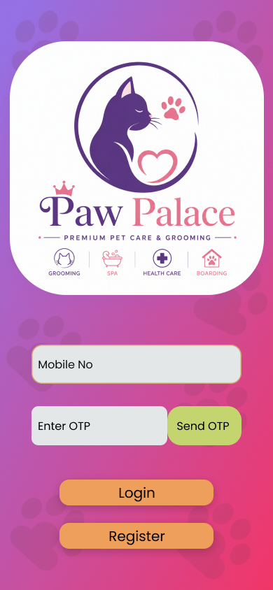
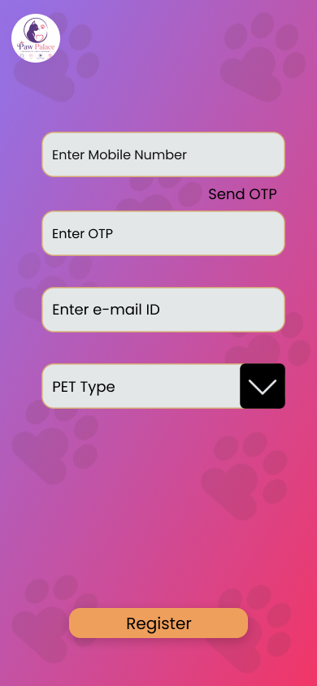
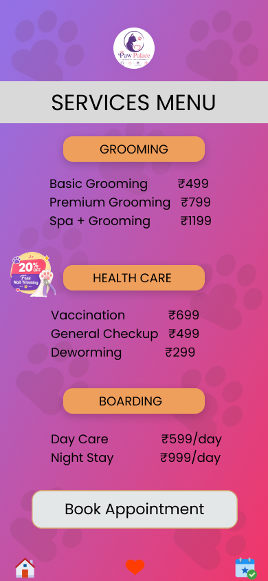

# 🐾 Paw Palace – Pet Care & Grooming App UI

## 📌 Project Overview

Paw Palace is a mobile application UI/UX design created in Figma for pet care and grooming services.

The application allows users to:

- Register and Login
- Select their pet
- Browse available services
- Book appointments
- Choose available time slots
- Receive booking confirmation

---

## 🎯 Features

- Splash Screen
- Login Screen
- Registration Screen
- Pet Selection
- Service Menu
- Appointment Booking
- Slot Selection
- Booking Confirmation
- Interactive Prototype

---

## 📱 Screens Designed

| Screen | Description |
|----------|-------------|
| Splash Screen | App welcome screen |
| Login | User login |
| Register | User registration |
| Pet Selection | Choose pet type |
| Services | View available services |
| Slot Booking | Select appointment slot |
| Confirmation | Booking success screen |

---

## 🎨 Design Tools

- Figma
- UI Design
- Prototyping
- User Flow Design

---

## 🐶 Pet Types Included

- Cat
- Dog
- Rabbit
- Bird

---

## 📸 App Screenshots

### Splash Screen

### Loading Animation 1

### Loading Animation 2

### Loading Animation 3

### Login Screen

### Register Screen

### Pet Selection Screen

### Services Screen

### Slot Booking Screen

### Booking Confirmation Screen

## 🔗 Project Links

- [Figma Design File](https://www.figma.com/design/qBi28VUizNXzQJo6MNCLpE/Task-1?node-id=0-1&t=IGpae5V2km0dHAqO-1)

- [Interactive Prototype](https://www.figma.com/proto/qBi28VUizNXzQJo6MNCLpE/Task-1?node-id=0-1&t=IGpae5V2km0dHAqO-1)

## 👨‍💻 Designed By

**IYYAPPAN VYSHNAV**

UI/UX Internship Project - FUTURE_UX_01

2026
